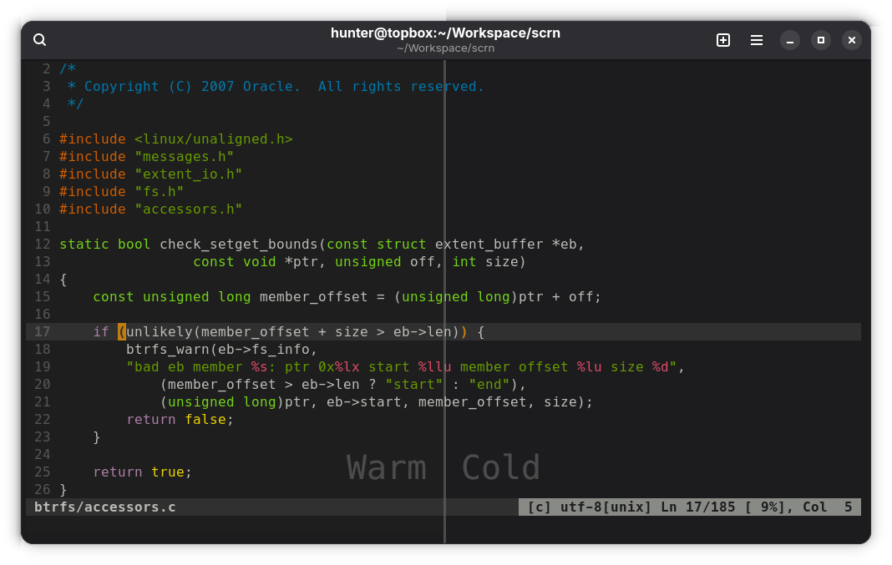

# builder-dark.vim

builder-dark.vim is a vim color scheme based on the builder-dark theme 
from Gnome Builder (which is itself based on freedesktop.org's Tango 
color palette). builder-dark comes in two variants: builder-dark-warm and builder-dark-cold.

This color scheme requires full color support in your terminal of 
choice.

### Installation

Copy `colors/builder-dark-*.vim` to `~/.vim/colors/` then add the following to your `~/.vimrc` file:

```
syntax on
colorscheme builder-dark-warm
```
*For the warm variant*

Or

```
syntax on
colorscheme builder-dark-cold
```
*For the cold variant*
