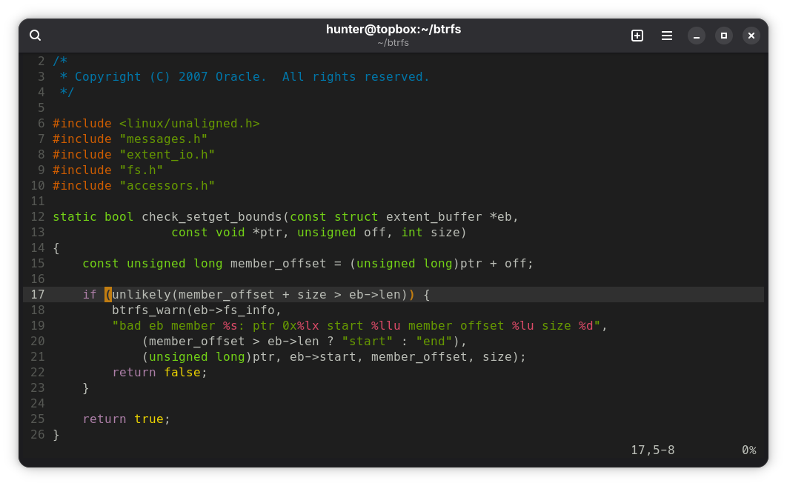

# builder-dark.vim

builder-dark.vim is a vim color scheme based on the builder-dark theme 
from Gnome Builder (which is itself based on freedesktop.org's Tango 
color palette).

This color scheme requires full color support in your terminal of 
choice and the following to be set in your `~/.vimrc` file:

```
set termguicolors
```

### Installation

Copy `colors/builder-dark.vim` to `~/.vim/colors/` then add the following to your `~/.vimrc` file:

```
colorscheme builder-dark
```
